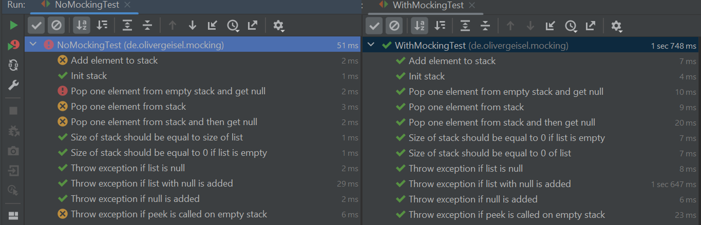
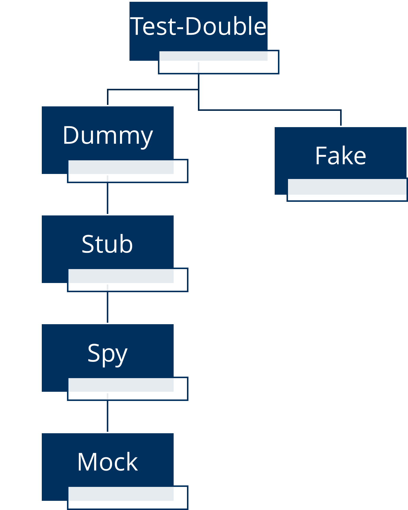

# Mocking und Test-Driven Development

In der Softwareentwicklung ist es wichtig, dass die Software getestet wird. Während der Entwicklung werden
immer wieder Änderungen am Code vorgenommen. Damit dieser Code keinen Fehler enthält, werden automatisierte Tests
ausgeführt.
Diese Tests müssen schnell ausführbarsein, damit jede Änderung am Code sofort getestet werden kann.
Oft ist es aber nicht möglich, dass die Tests schnell ausgeführt werden können, da die Software mit anderen
Systemen kommuniziert. Diese Kommunikation ist oft langsam oder nicht immer verfügbar. Deshalb werden **Mocks**
erstellt, die die Kommunikation mit anderen Systemen simulieren. Dadurch können die Tests schnell ausgeführt werden.

Oft schreiben Entwickler zuerst den Code und dann die Tests. Dies kann aber zu Problemen führen, da der Code nicht
testbar ist. Deshalb wird zuerst der Test geschrieben und dann der Code. Dieses Vorgehen wird Test-Driven Development
bezeichnet.
In diesem Projekt werden die Grundlagen von Mocking und **Test-Driven Development (TDD)** erklärt.

## Mocking

Mocking bedeutet übersetzt "verhöhnen" oder "vortäuschen". In der Softwareentwicklung ist eher zweiteres zutreffend.
Es wird also eine vereinfachte Kopie eines Objektes erstellt. diese Kopie werden auch *Doubele* genannt. Der große
Vorteil von Mocks ist, dass sie schnell erstellt werden können und nur "kurze Ausführungszeiten" haben.
Das Verhalten von Mocks wird ebenfalls vorbestimmt. Das bedeutet, dass die Rückgabewerte der genutzten Methoden
festgelegt werden. Dies wird auch *Stubbing* genannt.
Mocks kommen besonders bei Unittests zum Einsatz.
Bei Unittests werden einzelne Komponenten der Software getestet. Diese Komponenten sollten in den Test nicht durch
andere Komponenten beeinflusst werden. Deshalb werden Mocks erstellt, die die anderen Komponenten simulieren und ein
genaues Verhalten haben um somit den Bereich der Fehler auf die zu testende Komponente begrenzen.
Mocks sind also nicht so komplex wie die echten Objekte. Sie haben nur die Methoden, die für den Test benötigt werden.

### Warum Mocks?
Weshalb es sinnvoll ist, Mocks zu verwenden, soll an einem Beispiel gezeigt werden. Es gibt in diesem Projekt eine Klasse `StackWrapper` (in `src/main/java/de.olivergeisel.mocking`). Die Aufgabe des Wrappers ist es eine existierende Liste zu nehmen und zeitlich zu einem Stack zu machen. Bedeutet die Liste arbeitet jetzt nach dem LIFO-Prinzip.

In dem Testordner sind zwei Testklassen vorhanden. Eine mit und eine Ohne Mocking der Liste. 
Die Klasse `NoMockingTest` (in `src/test/java/de.olivergeisel.mocking`) testet die Klasse `StackWrapper` ohne Mocking, während die Klasse `WithMockingTest` (in `src/test/java/de.olivergeisel.mocking`) mit Mocking testet.
Beide Klassen haben die gleichen Tests. Im folgenden Bild sind die Ergebnisse der Tests zu sehen.



Wir sehen, dass ohne Mocking die Tests fehlschlagen, während die Tests mit Mocking erfolgreich sind. Der Grund liegt nicht im Stack, sondern in der Liste. Hier wurde eine fehlerhafte Implementierung der Liste verwendet. Mit Mocking der Liste ist aber zu sehen, dass der Wrapper wie gewünscht funktioniert.


### Die Hierarchie der Doubles

Leider sind die Begriffe für Doubles nicht einheitlich. Es gibt verschiedene Definitionen. In diesem Projekt wird die
Definition von Meszaros verwendet. Diese ist auch in seinem Buch "xUnit Test Patterns" zu finden.
Es gibt verschiedene Arten von *Doubles*. Diese sind hierarchisch angeordnet.
Mocks sind die komplexe Form der Doubles.
Es gibt aber deutlich simplere Formen von Doubles.
Die folgende Abbildung zeigt die Hierarchie der Doubles.



#### Dummy

Das einfachste Double ist der **Dummy**.
Dieser wird nur verwendet, damit die Parameter einer Methode übergeben werden können.
Der Dummy wird aber nicht verwendet.
Er ist nur ein Platzhalter. Dummy-Objekte werden daher oft nur für Konstruktoren verwendet.
Ein Beispiel ist folgendes Szenario:
Es gibt eine Klasse `Auskunft`, die ein Objekt der Klasse `Telefonbuch` benötigt. Jedoch ist dieses Objekt sehr komplex.
Es soll aber nur getestet werden, dass ein `Auskunft`-Objekt erstellt werden kann.
Deshalb wird ein Dummy von `Telefonbuch` erstellt. In diesem Beispiel wurde die Klasse `TelefonbuchDummy` genannt und erbt von `Telefonbuch`.

```java
public class DummyExample {

	private Auskunft auskunft;

	@Test
	public void testKonstruktor() {
		Telefonbuch telefonbuch = new TelefonbuchDummy();
		auskunft = new Auskunft(telefonbuch);
		// test war erfolgreich
	}
}
```

#### Stub

Der **Stub** ist ein Dummy, bei dem die Methoden "teilweise" implementiert sind. Sie sind also nur ein Stumpf von einer
vollständigen Implementierung. Daher auch der Name.
Charakteristisch für Stubs ist, dass sie immer einen festen Rückgabewert zu einer Eingabe liefern. Dieses
Verhalten wird vorher definiert (Stubbing).

In dem Szenario mit der Auskunft und dem Telefonbuch wäre ein Stub des Telefonbuches, bei dem die Anzahl der Einträge
festgelegt ist. Die Methode `getAnzahlEintraege()` liefert immer den Wert 100 zurück.
Eine andere Methode `getEintrag(String name)` liefert immer den gleichen Eintrag zurück.

```java
public class TelefonbuchStub extends Telefonbuch {

	@Override
	public Eintrag getEintrag(String name) {
		if (name.equals("Max Mustermann")) {
			return new Eintrag("Max Mustermann", "12345");
		} else {
			return null;
		}
	}

	@Override
	public int getAnzahlEintraege() {
		return 100;
	}
}
```

Dieser Stub kann nun in einem Test verwendet werden.

```java
public class StubExample {

	private Auskunft auskunft;

	@Test
	public void testKonstruktor() {
		Telefonbuch telefonbuch = new TelefonbuchStub();
		auskunft = new Auskunft(telefonbuch);
		assertEquals(100, auskunft.getAnzahlEintraege());
		assertEquals("12345", auskunft.getTelefonnummer("Max Mustermann"));
	}
}
```

#### Spy

Der **Spy** ist ein Stub, der seine Aufrufe protokolliert.
Also neben dem Stubbing wird auch das Verhalten des Objektes protokolliert.
So kann Beispielweise überprüft werden, ob eine Methode aufgerufen wurde.
Ein Beispiel ist folgendes Szenario:
Bei dem Szenario mit der Auskunft und dem Telefonbuch soll überprüft werden, ob die Methode `getEintrag(String name)`
entsprechend oft aufgerufen wird.

```java
public class TelefonbuchSpy extends Telefonbuch {

	private int anzahlAufrufe = 0;

	@Override
	public Eintrag getEintrag(String name) {
		anzahlAufrufe++;
		if (name.equals("Max Mustermann")) {
			return new Eintrag("Max Mustermann", "12345");
		} else {
			return null;
		}
	}

	public int getAnzahlAufrufe() {
		return anzahlAufrufe;
	}
}
```

Im Test wird nun überprüft, ob die Methode `getEintrag(String name)` entsprechend oft aufgerufen wurde.

```java
public class SpyExample {

	private Auskunft auskunft;

	@Test
	public void testKonstruktor() {
		Telefonbuch telefonbuch = new TelefonbuchSpy();
		auskunft = new Auskunft(telefonbuch);
		assertEquals(100, auskunft.getAnzahlEintraege());
		assertEquals("12345", auskunft.getTelefonnummer("Max Mustermann"));
		assertEquals(1, telefonbuch.getAnzahlAufrufe());
		var eintrag2 = auskunft.getTelefonnummer("Tina Mustermann");
		assertNull(eintrag2);
		assertEquals(2, telefonbuch.getAnzahlAufrufe());
	}
}
```

#### Mock

Der **Mock** ist ein Spy, der seine Aufrufe überprüft. In Test wird also direkt das Mock-Objekt zur Überprüfung der
Tests genutzt. Wenn man z.B. in Java JUnit verwendet, dann werden nicht mehr die `assertX`-Methoden verwendet,
sondern die Methoden des Mock-Objektes, das das protokollierte

#### Fake

Eine weitere Form von Doubles sind **Fakes**. Diese sind keine vereinfachten Kopien von Objekten, sondern
eigene Implementierungen. Diese sind aber deutlich einfacher als die echten Objekte.
Jedoch haben sie ein ähnliches Verhalten wie die echten Objekte.
Sie werden aber auch sehr schnell komplex. Deshalb werden sie oft nur für sehr einfache Fälle verwendet.

### Mocken oder nicht Mocken, das ist hier die Frage

Es muss nicht immer gemockt werden. Es gibt auch Fälle, in denen es nicht sinnvoll ist, Mocks zu verwenden.
Einige Arten von Klassen sollten nicht gemockt werden. Dazu gehören z.B. **Value-Objekte**.
Value-Objekte charakterisieren sich dadurch, dass sie nur Daten enthalten, keine Identität besitzen, auf Gleichheit
durch die enthaltenen Daten geprüft werden und ihre Daten unveränderlich sind.
Es gibt auch Definitionen, die Value-Objekte anders definieren. Diese werden aber hier nicht weiter betrachtet.

Mockito empfiehlt auf ihrer [Webseite](https://site.mockito.org/) keine Typen zu mocken, die einem nicht gehören.
Dazu gehören z.B. Typen aus dem JDK oder aus Bibliotheken.
Es wird empfohlen, dass nur eigene Typen gemockt werden.
Spring hat z.B. eigene Klassen, die Mocks für bestimmte Typen erstellen können.

### Mocking Frameworks

Im vorherigen Kapitel war zu sehen, das die Erstellung von Mocks schnell sehr aufwendig werden kann.
Deswegen gibt es Mocking Frameworks, die die Erstellung von Mocks vereinfachen.

#### Mockito

Mockito ist ein Mocking Framework für Java. Es ist sehr einfach zu verwenden und bietet viele Möglichkeiten.
Es ist auch sehr gut dokumentiert. Auf der [Webseite](https://site.mockito.org/) gibt es einige Beispiele und
Erklärungen.
Hier soll nur eine kurze Einführung in Mockito gegeben werden. Die offizielle
[Dokumentation](https://javadoc.io/doc/org.mockito/mockito-core/latest/org/mockito/Mockito.html) bietet deutlich mehr
Informationen. Es wird geraten bevor man
sich mit den Aufgaben weiter unten beschäftigt, sich diese anzuschauen. Dennoch seien die Grundlagen hier kurz erklärt.

##### Mocks erstellen

Um Mocks zu erstellen, gibt es eine bestimmte Methode der Klasse `Mockito`. Diese heißt `mock()`.
Diese Methode erwartet als Parameter den Typ (Das Class-Objekt) des Mocks. \
Tipp: die Methode `mock()` sollte statisch importiert werden.

```jshelllanguage
import static org.mockito.Mockito.mock;
	var mock = mock(Telefonbuch.class);
```

Eine andere Möglichkeit ist es die Annotation `@Mock` zu verwenden. Diese kann auf ein Attribut oder eine Methode
angewendet werden. Mockito erstellt dann automatisch ein Mock-Objekt. Es muss aber vorher die Methode
`MockitoAnnotations.initMocks(this)` aufgerufen werden oder die Annotation `@RunWith(MockitoJUnitRunner.class)` auf die
Testklasse angewendet werden.

```java

@ExtendWith(MockitoExtension.class) // entweder diese Annotation oder die initMocks-Methode
public class MockAnnotationExample {

	@Mock
	private Telefonbuch telefonbuch;

	@BeforeEach
	public void initMocks() {
		MockitoAnnotations.initMocks(this);
	}

	@Test
	public void testKonstruktor() {
		Auskunft auskunft = new Auskunft(telefonbuch);
		assertEquals(100, auskunft.getAnzahlEintraege());
		assertEquals("12345", auskunft.getTelefonnummer("Max Mustermann"));
	}
}
```

##### Stubbing von Mocks

Die erstellten haben zwar die gleichen Methoden wie die echten Objekte, aber sie liefern immer `null` zurück.
Deswegen muss das Verhalten der Methoden noch "konfiguriert" werden. Dies geschieht mit der Methode `when()`
und `thenReturn()`.
Beide Methoden wirken etwas seltsam. Die Methode `when()` erwartet als Parameter einen Methodenaufruf (Nachricht).
Das ist jedoch nicht der Aufruf der Methode, sondern nur der Name der Methode mit ihren Parametern.
Es können bestimmte Parameter wie z.B. `"Hallo Welt"` oder allgemeine Parameter wie `anyString()` angegeben werden.
Die Methode `thenReturn()` erwartet den Rückgabewert der Methode. Dieser kann auch ein Mock sein.

```java
class ExampleMockTest {
	@Test
	@DisplayName("Test mit bestimmten Parametern in gestubter Methode")
	public void testWithSpecificParams() {
		Telefonbuch telefonbuch = mock(Telefonbuch.class);
		when(telefonbuch.getAnzahlEintraege()).thenReturn(100);
		when(telefonbuch.getEintrag("Max Mustermann")).thenReturn(new Eintrag("Max Mustermann", "12345"));
		auskunft = new Auskunft(telefonbuch);
		assertEquals(100, auskunft.getAnzahlEintraege());
		assertEquals("12345", auskunft.getTelefonnummer("Max Mustermann"));
	}

	@Test
	@DisplayName("Test mit allgemeinen Parametern in gestubter Methode")
	public void testWithAnyParams() {
		Telefonbuch telefonbuch = mock(Telefonbuch.class);
		when(telefonbuch.getAnzahlEintraege()).thenReturn(100);
		when(telefonbuch.getEintrag(anyString())).thenReturn(new Eintrag("Max Mustermann", "12345"));
		auskunft = new Auskunft(telefonbuch);
		assertEquals(100, auskunft.getAnzahlEintraege());
		assertEquals("12345", auskunft.getTelefonnummer("Max Mustermann"));
	}
}
```

##### Verifizieren von Mocks

Nun kann das Verhalten des Mocks überprüft werden. Dazu gibt es die Methode `verify()`.
Diese erwartet als Parameter den Mock und die Methode, die überprüft werden soll.
Es kann auch angegeben werden, wie oft die Methode aufgerufen werden soll.

```java
class ExampleVerify {
	@Test
	public void testVerify() {
		Telefonbuch telefonbuch = mock(Telefonbuch.class);
		when(telefonbuch.getAnzahlEintraege()).thenReturn(100);
		when(telefonbuch.getEintrag("Max Mustermann")).thenReturn(new Eintrag("Max Mustermann", "12345"));
		auskunft = new Auskunft(telefonbuch);
		assertEquals(100, auskunft.getAnzahlEintraege());
		assertEquals("12345", auskunft.getTelefonnummer("Max Mustermann"));
		verify(telefonbuch, atLeast()).getAnzahlEintraege();
		verify(telefonbuch, times(1)).getAnzahlEintraege();
		verify(telefonbuch, times(1)).getEintrag("Max Mustermann");
	}
}
```

### Mocking mit Spring

Spring bietet von Haus aus eigene Klassen, die Mocks für bestimmte Klassen erstellen können.
Das sind z.B. Mocks zum Testen von Controllern oder Repositories.

Wir werden hier die möglichen MockObjekte nur erwähnen bzw. kurz erklärt. Der konkrete Einsatz/Nutzen wird in
anderen Kapiteln genauer behandelt.
Alternativ kann natürlich auch die Dokumentation von Spring gelesen werden.

#### MockBean

Diese Annotation wird für Services oder Repositories verwendet. Sie erstellt ein Mock-Objekt, das in den Spring Context eingebunden wird.
Dokumentation der MockBean-Annotation in Spring: [Link](https://docs.spring.io/spring-boot/docs/current/api/org/springframework/boot/test/mock/mockito/MockBean.html)

#### @WithMockUser

Diese Annotation erstellt Mock eines Benutzers. Dieser Mock wird dann für die Authentifizierung verwendet.
Es können verschiedene Parameter angegeben werden, wie z.B. der Benutzername, die Rollen oder die Berechtigungen.
Die Dokumentation ist [hier](https://docs.spring.io/spring-security/site/docs/current/api/org/springframework/security/test/context/support/WithMockUser.html) zu finden.

#### MockMvc

Dieser Mock wird verwendet, um Controller zu testen. Er kann verwendet werden, um HTTP-Requests an einen Controller zu
senden und die Antworten zu überprüfen. Er minimiert die Komponenten, die für den Test benötigt werden.
Dokumentation des MockMVC in Spring: [Link](https://docs.spring.io/spring-framework/docs/current/javadoc-api/org/springframework/test/web/servlet/MockMvc.html)

#### WebTestClient

Dieser Mock ist etwas komplexer als der MockMvc. Er ist ein Client, der den Web-Server anfragen kann.
Er kann verwendet werden, um HTTP-Requests die Anwendung zu senden und die Antwort überprüfen.
Dokumentation des WebTestClient in Spring: [Link](https://docs.spring.io/spring-framework/docs/current/javadoc-api/org/springframework/test/web/reactive/server/WebTestClient.html)


<hr>

## Test-Driven Development (TDD)

Es gibt ein Problem mit Softwareentwicklern, besonders wenn sie jung sind. Sie wollen immer sofort loslegen und Code
schreiben. Sie testen ihren Code nur wenig bis gar nicht. Erst wenn der Code fertig ist, wird er getestet. Dann wird die
Software gestartet und geprüft, ob sie funktioniert. Oft funktioniert es nicht und der Entwickler startet den Debugger
und versucht den Fehler zu finden. Nach einiger Zeit ist der Fehler auch gefunden und behoben. Dann wird die Software
wieder gestartet und geprüft, ob sie funktioniert. Oft funktioniert es immer noch nicht. Dann wird wieder der Debugger
gestartet und der nächste Fehler wird gesucht. Dieser Zyklus wiederholt sich so lange, bis die Software funktioniert.
Dieses Vorgehen ist sehr ineffizient. Es wird viel Zeit damit verschwendet, Fehler zu suchen. Ein effizienterer Weg ist
es, die Software zu testen, während sie entwickelt wird. Dieses Vorgehen wird Test-Driven Development (TDD) genannt.

### Was ist TDD?

Test-Driven Development (TDD) ist eine Methode, bei der noch bevor der Code geschrieben wird, bereits Tests vorhanden
sind, die den Code testen. Es wird also erst die Kontrolle geschieben, bevor der Produktivcode überhaupt exsistiert.
Es müssen jedoch nicht alle Tests geschrieben werden, bevor der Code geschrieben wird. Es werden nur die Tests
geschrieben, die die Funktionalität beschreiben, die als nächstes implementiert werden soll. Es wird also immer nur ein
kleiner Teil der Software getestet. Dieser Teil wird dann implementiert. Danach wird der nächste Teil getestet und
implementiert. Dieser Zyklus wird so lange wiederholt, bis die Software fertig ist.
Dieser Zyklus ist auch in der folgenden Abbildung zu sehen. 

### TDD für Entwickler

Für Softwarentwickler ist TDD eine sehr gute Methode, um Software zu entwickeln. Es gibt aber auch einige Probleme, die
bei der Anwendung von TDD auftreten können. Diese Probleme werden im Folgenden beschrieben.

#### TDD ist nicht einfach

### Die drei Schritte von TDD

TDD kann in drei Schritte unterteilt werden. Erstellen des Tests, Implementieren des Codes und Refactoring. Robert C.
Martin beschreibt diese Schritte in seinem Buch "Clean Craftmanship" wie folgt:

1. Schreibe einen Test, der fehlschlägt.
2. Schreibe den Code, der den Test erfolgreich macht.
3. Refactor den Code, um ihn sauber zu machen.

<hr>

## Übung 1: TDD komplett übertrieben

<span style="color:red">**Achtung!** Ab hier ist noch nicht alles vollständig!</span>

Die erste Übung soll TDD in einer sehr extremen Form zeigen. Es gibt eine Testklasse `TDD_01_Schritt_fuer_Schritt.java`.
In dieser sind alle Tests bereits vorhanden aber auskommentiert. Die Aufgabe ist es, die
Klasse `TDD_01_Schritt_fuer_Schritt.java` so zu implementieren, dass alle Tests erfolgreich sind. Dabei soll immer nur
ein Test auskommentiert werden

**Hinweis!
** Wie in der Überschrift zu lesen ist, ist dieses Beispiel sehr übertrieben. Es soll nur zeigen, wie TDD funktioniert
und dem Entwickler hilft bzw. in diesem Fall sogar eine Schritt-für-Schritt-Anleitung ist, wie eine Klasse implementiert
werden kann.
Einige, der vorhandenen Test, sind auch nicht sinnvoll und sollten in der Realität nicht unbedingt so genutzt werden.
Sie sind entsprechend mit einer `@Tag(...)` Annotation markiert. Sie sind nur vorhanden, um die Klasse zu
implementieren.

### Szenario

Es soll eine Entity
*TelefonbuchEintrag* erstellt werden und in eine Spring Boot Anwendung integriert werden. Alle weiteren Dinge wie
Controller, Service und Repository sind bereits vorhanden. Es soll nur die Entity implementiert werden.

Die Entity soll folgende Attribute haben:
*Nachname*, *Vorname*, *Telefonnummer* und *Adresse*.

### Zusammenfassung

In dieser Übung wurde TDD genutzt

## Übung 2: TDD realistisch - TODO

## Texte für später

Es soll ein Service für das Verwalten von Benutzern in eine Spring Boot Anwendung integriert werden. Controller
Entitäten und Repositories sind bereits vorhanden. Es soll nur der Service implementiert werden. Es sind nur Unittests
vorhanden.
<!-- Todo Integration Tests hinzufügen-->

Der Service soll folgende Funktionalitäten bieten:

- Erstellen eines neuen Benutzers
- Löschen eines Benutzers
- Ändern eines Benutzers
- Suchen eines Benutzers anhand der ID
- Suchen eines Benutzers anhand des Nachnamens
- Alle Benutzer erhalten
- Suchen aller Benutzer, die einen bestimmten Nachnamen haben
