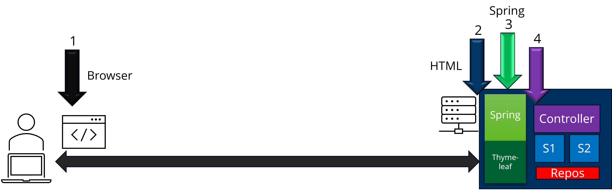

# Integrationstests

## Was sind Integrationstests?

Integrationstests sind Tests, die die Interaktion zwischen Komponenten eines Systems testen.
Dabei wird das System als Ganzes betrachtet. Es wird nicht nur eine Komponente getestet, sondern auch die Interaktion zwischen den Komponenten.

Nach dem ISTQB ist ein Integrationstest:

> "Integrationstests konzentrieren sich auf die Interaktion zwischen Komponenten oder Systemen" [deutscher ISTQB-Lehrplan S.35](https://www.german-testing-board.info/wp-content/uploads/2022/01/GTB-CTFL_Lehrplan_v3.1_DE.pdf)

Im Gegensatz zu Unittests, die nur eine Komponente testen, testen Integrationstests folglich das Zusammenwirken von mehreren Komponenten.
Die Komplexität ist durch die Verbindung der verschiedenen Komponenten höher, als bei Unittests.

### Unterscheidung innerhalb von Integrationstests

Das ISTQB unterscheidet zwischen 2 Stufen von Integrationstests:

* Komponentenintegrationstests
* Systemintegrationstests

er Unterschied steht bereits in den Namen. Komponentenintegrationstests testen die Interaktion zwischen Komponenten während Systemintegrationstests die Interaktion zwischen Systemen testen.
Beide Stufen werden "nach" der entsprechenden Stufe der Komponenten- bzw. Systemtests durchgeführt. \
Was ist mit "nach" gemeint?
Im Normalfall sollten erst alle Unittests ausgeführt werden und erst danach die Integrationstests. Der Grund ist relativ offensichtlich.
Wenn bereits in der isolierten Komponente ein Fehler ist, wieso sollte der Fehler in der Integration dann verschwinden? Deshalb führt man die Integrationstests erst nach den Unittests bzw. Systemtests aus.

<hr>

## Spring Boot Integrationstests

Spring Boot besitzt Tools, die das Erstellen von Integrationstests erleichtern.
Eine erste Möglichkeit ist die Annotation `@SpringBootTest`.
Jede Testklasse, die diese Annotation besitzt, wird als Integrationstest ausgeführt.
Weil die gesamte Spring Boot Umgebung gestartet wird, dauert das Ausführen der Tests länger als bei Unittests.
Deswegen sollte die Anzahl der Tests mit dieser Annotation nicht übertrieben sein.
Ein weiterer Nachteil ist, dass die Spring Boot Umgebung für jeden Test bzw. Testklasse neu gestartet wird.
Dadurch dauert das Ausführen der Tests noch länger.
Folgender Code zeigt ein Beispiel für einen Integrationstest mit `@SpringBootTest`:

```java

@SpringBootTest
class MyTest {

	@Test
	void contextStart () {
	}
}
```

Dieser Test lädt die Spring Boot Umgebung und prüft, ob diese geladen werden kann.
Wenn die Spring Boot Umgebung nicht geladen werden kann, schlägt der Test fehl.
Das ist ein simpler Test. Er testet nur, ob die Spring Boot Umgebung geladen werden kann.

### Repository Integrationstests

Wie bereits in den Unittests erwähnt, ist es eine Frage der Perspektive, ob jetzt die gezeigten Repository-Tests Unit- oder Integrationstests sind.
Deshalb sind hier keine neuen Tests für Repositories eingeführt.
Lediglich eine andere Möglichkeit für die Datenbank wird hier vorgestellt.
> **Hinweis:
** Die vorgestellte Möglichkeit ist sehr fortgeschritten und sollte nur verwendet werden, wenn es wirklich nötig ist. Für Anfänger ist das nicht zu empfehlen. Es ist für das Selbststudium gedacht.

#### Testcontainers

Testcontainers ist eine Bibliothek, die es ermöglicht, Datenbanken in Containern zu starten. Dafür wird **Docker
** benötigt.
Dadurch wird die Datenbank in einem Container gestartet und nicht auf dem Host-System. Durch diesen Vorgang wird auch die tatsächliche Datenbank nicht angefasst.
Nachdem die Tests durchgeführt wurden, wird der Container mit der Datenbank wieder gelöscht.

 <span style="color:yellow"> TODO: Testcontainers Beispiel einfügen </span>

### Entitäten Integrationstests

> **Hinweis:**
> Integrationstests für Entitäten sind nur bedingt sinnvoll bzw. notwendig. Dieser Abschnitt zeigt nur Möglichkeiten und könnte übersprungen werden.

Es gibt nicht viele Tests für die Entitäten. Das liegt daran, dass die Entitäten nur Getter, Setter und sehr wenig Logik besitzen. Das ist aber bereits in den Unittests getestet worden.
Das was übrig bleibt sind die Konfigurationen der Entitäten für die Datenbank. Diese werden in den Integrationstests getestet.
Zählen wir mal die Annotationen bei Entitäten auf:

* `@Entity`
* `@Table`
* `@Id`
* `@GeneratedValue`
* `@Column`
* `@OneToOne`,`@ManyToOne`, `@OneToMany`, `@ManyToMany`
* `@Embedded`
* `@ElementCollection`
* `@Enumerated`

Viele davon lassen sich aber nicht sehr gut testen.
Der Aufwand ist zu groß und der Nutzen zu gering.
In Spring würde es auch sehr schnell auffallen, wenn eine Annotation falsch gesetzt wurde.

### Service Integrationstests

### Controller Integrationstests

Zu den Controllen kann es sehr viele Integrationstests an verschiedenen Stellen in der Anwendung geben.


In dem Bild sind die verschiedenen Stellen markiert, an denen Integrationstests für die Controller geschrieben werden können.
Der aber sinnvollste Ort für Integrationstests mit Controllern, ist Stelle 2.
An dieser Stelle wird der Controller mit minimalen Ressourcen getestet. Dadurch wird die Laufzeit der Tests gering gehalten.

#### MockMvc

An der Stelle 2 wird der Controller mit MockMvc getestet. MockMvc ist eine Klasse, die wie der Name verrät, ein Mock für das MVC-Pattern bzw. "Spring MVC".
Diese Klasse kann alle 3 Bestandteile des MVC-Patterns prüfen.

* Model
* View
* Controller

Am Ende können alle 3 Bestandteile getestet werden. \
Der Trick dabei ist jedoch, dass man nicht direkt die Methoden des Controllers aufruft, sondern eine HTTP-Request "ausführt".

#### HTTP-Request

Was ist damit gemeint? Nun das MockMvc-Objekt besitzt eine Methode `perform()`, die HTTP-Requests simuliert. Das können z.B.
*get*, *post*, *put* oder *delete* sein.

Ein Beispiel für einen Test mit MockMvc sieht so aus:

```java

@ExtendWith(SpringExtension.class)
@WebMvcTest(controllers = {MyController.class})
class ControllerTest {

	@Autowired
	private MockMvc mockMvc;

	@Test
	void test () {
		mockMvc.perform(get("/"));
	}
}

@Controller
class MyController {

	@GetMapping("/")
	public String get () {
		return "index";
	}
}
```

In diesem Beispiel wird der Controller `MyController` getestet.
Das `MockMvc`-Objekt wird mit der Annotation `@WebMvcTest` konfiguriert.
Durch den Parameter `controllers = {MyController.class}` wird der Controller `MyController` in den Test geladen.
Nun kann mit der Methode `perform()` ein HTTP-Request ausgeführt werden.
Dazu muss die Methode des Requests angegeben werden. In diesem Fall ist es `get()`. Durch die Angabe des Pfades `/` wird die passende Methode des `MyController` aufgerufen.

#### Assertions und ResultMatcher

Da es sich bei dem MockMvc-Objekt um ein Mock handelt, besitzt
das Objekt auch Methoden, die die Ergebnisse des Requests prüfen können.
Dazu gehören die Methoden `andExpect()` und `andDo()`.

Folgendes Beispiel zeigt einen Test, der prüft, ob der Request erfolgreich und ohne Fehler war (Statuscode 200):

```jshelllanguage

	@Test
	void testAllOkay () {
		mockMvc.perform(get("/"))
			   .andExpect(status().isOk());
	}
```

Die Methode `andExpect()` erwartet ein `ResultMatcher`-Objekt. Dieses Objekt wird dann ausgewertet und bestimmt den Erfolg oder Misserfolg des Testes. Die Methode `status()` erstellt einen `ResultMatcher`, der den Statuscode des Requests prüft. \
Es gibt verschiedene ResultMatcher.
Jeder von denen hat einen eigenen Bereich, den er prüft. (Auswahl)

* `status()` - prüft den Statuscode des Requests
* `request()` - prüft die Eigenschaften des Requests
* `content()` - prüft den Inhalt des Requests
* `header()` - prüft die Header des Requests
* `model()` - prüft die Model des MVC-Patterns
* `view()` - prüft die View des MVC-Patterns
* `cookie()` - prüft die Cookies des Requests
* `redirectedUrl()` - prüft die Weiterleitung des Requests

Die Methode `andExpect()` kann auch mehrmals aufgerufen werden. Dadurch können mehrere ResultMatcher in einem Test verwendet werden.

```jshelllanguage

	@Test
	void testAllOkay () {
		mockMvc.perform(get("/"))
			   .andExpect(status().isOk())
			   .andExpect(content().string("Hello World!"));
	}
```

#### Alles drumherum

`@MockBean`

`@WithMockUser` ist hilfreich, wenn ein Nutzer benötigt wird, aber eben nicht erstellt werden soll.
Folgende Attribute können gesetzt werden:

* `username` - Der Nutzername des Nutzers
* `roles` - Die Rollen des Nutzers
* `authorities` - Die Berechtigungen des Nutzers
* `password` - Das Passwort des Nutzers

In welchen Fällen ist `@WithMockUser` nutzbar? \
Wenn z.B. ein Controller eine Methode besitzt, die nur für bestimmte Nutzer zugänglich ist.

`@AutoConfigureMockMvc` ist eine Annotation, die etwas mehr Konfigurationen für den MockMvc-Test ermöglicht. Es lädt automatisch alle nötigen Konfigurationen für den Test.

#### Beispiele für Controller Integrationstests

##### Controller mit Service

```java

@ExtendWith(SpringExtension.class)
@WebMvcTest(controllers = {MyController.class})
class ControllerTest {

	@Autowired
	private MockMvc mockMvc;

	@MockBean
	private MyService myService;

	@Test
	void test () {
		mockMvc.perform(get("/"))
			   .andExpect(status().isOk())
			   .andExpect(content().string("Hello World!"));
	}
}   
```

##### Controller mit eingeschränktem Zugriff

```java

@ExtendWith(SpringExtension.class)
@WebMvcTest(controllers = {MyController.class})
class ControllerTest {

	@Autowired
	private MockMvc mockMvc;

	@Test
	@WithMockUser(username = "user", roles = "USER")
	void test () {
		mockMvc.perform(get("/"))
			   .andExpect(status().isOk())
			   .andExpect(content().string("Hello World!"));
	}
}   
```